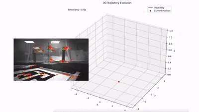
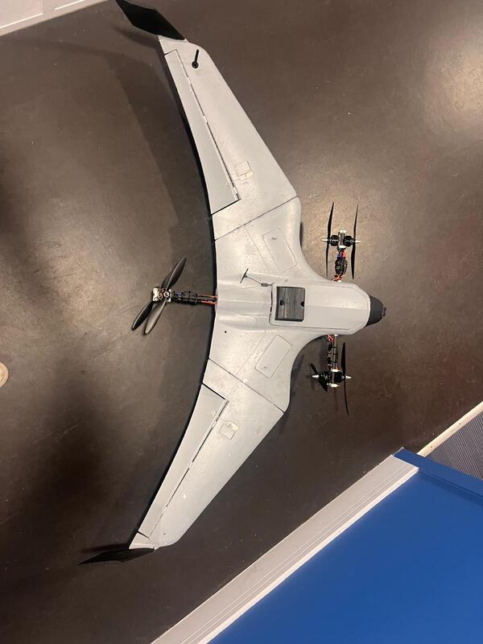

# MVIO: Monocular Visual Inertial Odometry





## Overview
MVIO is a robust Monocular Visual Inertial Odometry system designed for accurate state estimation on aerial platforms. It fuses data from a single camera and an Inertial Measurement Unit (IMU) to track trajectory and pose in real-time.

## Status & Compatibility
This project is **stable** and tested with the following library versions:

| Dependency | Version |
|------------|---------|
| **OpenCV** | `4.6`   |
| **Eigen**  | `3.4`   |

> [!NOTE]
> Ensure you have these specific versions installed for optimal stability.


## Installation

### Dependencies
The project provides a helper script to install all necessary dependencies (OpenCV, Eigen, etc.) for Linux (Ubuntu/Debian) and macOS.

```bash
./install_dependencies.sh
```

### Build
Use CMake to build the project:

```bash
mkdir build && cd build
cmake ..
make -j4
```

## Usage
After building, you can run the main executable from the project root or build directory.

```bash
./build/mvio
```

Configuration files are located in the `configs/` directory.
